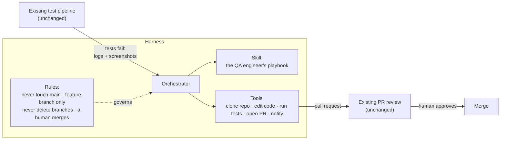
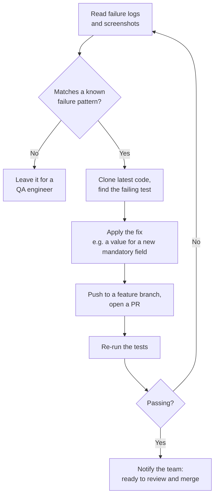

# Most Enterprise AI Agents Get Zero Users. Here's What Made Ours Stick.

*AI at Work, Week 1: what I actually learn solving enterprise problems with AI each week. No demos, no hype.*

  💡
  <h3>The short version</h3>
  
Plenty of enterprise AI agents and RAG bots get built, launched, and then hardly used. A good product doesn't earn adoption on its own; <b>you have to drive it.</b> This week an AI agent took over about <b>80%</b> of a team's manual test-fixing work, because it <b>fitted into a decades-old process instead of replacing it.</b>

  
<i>Written from my day job as a generative AI cloud architect, not from a slide deck.</i>

  
Want to talk about doing this in your team? <b>Write to me: <a href="mailto:dev.with.vijay@gmail.com?subject=AI%20at%20Work">dev.with.vijay@gmail.com</a></b>. I read every email.

## Where this comes from

Most of you know me as an instructor. What many don't know is that teaching is what I do **after** work. During the day I'm a **generative AI cloud architect**, solving real problems for a large enterprise. I sit in the meetings where AI ideas get approved, and in the ones where they quietly die.

That's the view this series comes from: the enterprise as it actually is, not as it looks in a LinkedIn post.

## The buzz vs. what I see at work

Open LinkedIn and you'd think enterprises change how they work every week, and every company will be run by agents by next quarter. RAG, agentic RAG, multi-agent systems, autonomous everything.

That's not what I see from inside. Here's my honest view:

**Knowing the buzzwords solves nothing.** You can talk about agentic RAG all day and not remove a single hour of real work from anyone's week. The value starts when AI is aimed at a real problem someone has, *inside the way they already work.*

## The story behind this week's lesson

We have a large enterprise application: many screens, many APIs. Customers customise it: a new screen here, a new report there, a new mandatory field on a form. Each customisation breaks some automated tests, and QA engineers spent their days working out why and fixing them by hand. Fix one, re-run, watch it fail somewhere else.

The obvious "AI" answer would have been: *replace the test process with an autonomous agent.* And it would have joined the long list of clever agents nobody uses. We didn't do that.

Instead, I sat down with a QA engineer, because I knew AI and they knew QA, and neither of us could solve this alone. We captured how *they* diagnose a failure and turned it into an AI skill. Now when the existing pipeline fails, an agent:
- reads the same logs and screenshots the engineer would
- fixes the test in the same repository
- raises a pull request through the same review process
- re-runs the tests until they pass

A human still approves every change.

### How it fits together: the harness

The agent isn't a standalone bot. It runs inside our **harness**, the control layer I wrote about in [Harness Engineering](blog-post.html?slug=harness-engineering-enterprise-ai-agents). For this problem we didn't build a new system. We added one **skill** to the harness, and the harness's **orchestrator**, **tools** and **rules** did the rest.

Look at both ends of the diagram: the existing pipeline and the existing PR review are untouched.

- **The orchestrator** receives the failure and decides what to do next.
- **The tools** do the hands-on work a developer would: clone the repository, edit code, run the tests, open the pull request, notify the team.
- **The rules** are the guardrails, and they aren't negotiable: never commit to the main branch, only work on a feature branch, never delete branches, and a human always merges. The agent is powerful, so its limits are written down, not assumed.

### A little more about the skill

In AI terms, a **skill** (a concept Anthropic popularised) is a packaged set of instructions the agent loads only when the task needs it. Ours is basically **the QA engineer's experience, written down**:
- how to read a failure log and a screenshot
- which failure patterns we've seen before, and what the right fix is for each
- how the test code is organised, and where a fix belongs
- what "done" means: the tests are green again

Here's the loop the skill runs:

Notice the **"No"** on the left. The skill doesn't try to fix everything. Failures it doesn't recognise go to a person, exactly as before. That's a big part of why the team trusts it.

The pipeline didn't change. The review process didn't change. Nobody learned a new tool. And about 80% of the cases that used to need a QA engineer now don't.

## What I'd tell anyone starting an AI project at work

**1. Processes are decades of lessons. Respect them.**
That approval step that looks slow? It's there because something went badly wrong once. When you try to sweep processes away with AI, you're also throwing away the reasons they exist, and people sense that and resist.

**2. Don't replace the workflow. Find the slowest step and fit in there.**
The best AI projects I've seen don't redesign anything. They find one painful, repetitive step that people already hate, and take it over quietly. Small surface, big relief.

**3. Adoption doesn't come with the product. You have to drive it.**
This is the part nobody on LinkedIn talks about. Show a team a better tool, even a clearly better one, and you'll often hear, politely: *"Thanks, but I'm comfortable filling in my Excel sheet."* I've heard versions of that more times than I can count.

You can't argue people out of that. What works is the opposite: **"Keep doing what you're doing. We'll make it faster around you."** Our agent doesn't ask the QA team to change anything. It works inside their pipeline and hands its work back as a pull request, through a door they already trust.

That's why so many enterprise AI agents and RAG bots end up with almost no active users. They were built well, but they asked people to change how they work. **An average agent that people actually use beats a brilliant one nobody opens.**

**4. Pair the AI person with the domain expert.**
I didn't understand QA. The QA engineer didn't understand AI. Every useful thing in this project came from the hours we spent together, not from the model.

**5. Don't rush. Things will settle.**
Enterprise ways of working evolved over decades, and they won't be replaced overnight. A three-person startup can rebuild everything around AI. A large enterprise can't, and shouldn't try. The teams getting real results are patient: one fitted-in improvement at a time.

## Four questions before your next AI idea

Before building anything, ask:

1. **Which exact step in today's process is slow, repetitive and disliked?**
2. **Who does that step today, and have I watched them do it?**
3. **How will the AI's output re-enter the existing process?** (A ticket, a PR, an email, a report people already read.)
4. **Who still approves the result?**

If you can't answer all four, you have a demo, not a solution.

## Next week

Every week I'm solving another real business problem with AI, and I'll share what worked, what didn't, and what I learned. That's *AI at Work*.

If this matches what you're seeing in your company, or completely contradicts it, **I'd like to hear from you: [dev.with.vijay@gmail.com](mailto:dev.with.vijay@gmail.com?subject=AI%20at%20Work).**

  🧭
  <h3>Building the skills for this kind of work?</h3>
  
My free DevOps 2026 Curriculum and GenAI Playbook cover the path from cloud and CI/CD to Kubernetes and AI agents that work inside real pipelines. Write to me and I'll send them to you personally.

  <a href="download.html" class="btn btn-outline">🧭 Email me for the free guides</a>

