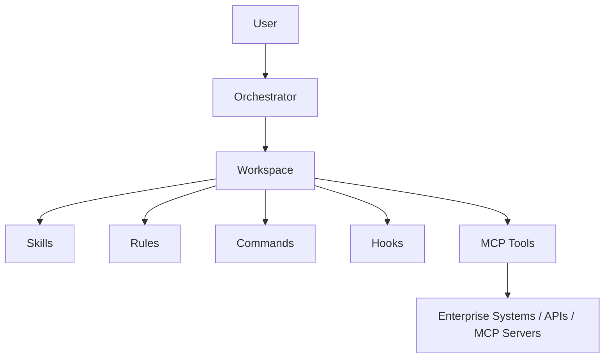
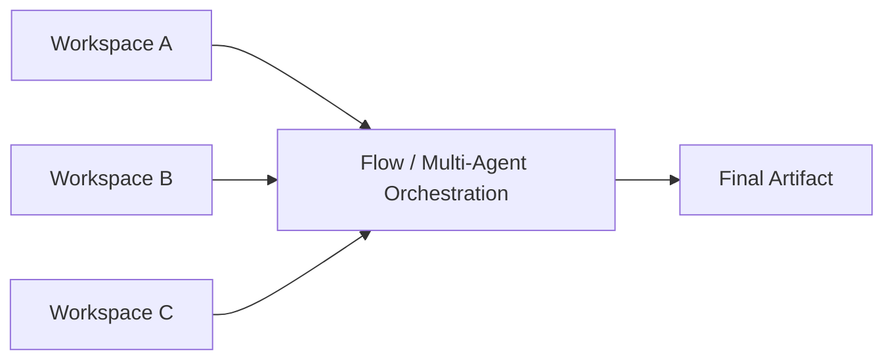
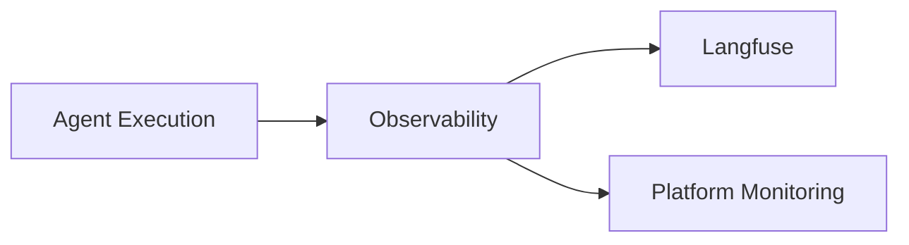

# Harness Engineering: The Control Layer That Makes Enterprise AI Agents Actually Work

*An LLM is a powerful horse. What I learned building the reins, the rider, and the road around it — and why that surrounding layer matters more than the model itself.*

## We Have Powerful Horses. Do We Have Reins?

A horse is an extraordinary animal. It is faster than you, stronger than you, and it can cover ground you could never cover on foot. But owning a powerful horse does not mean you can reliably get from one town to another, carrying a load, on time, without anyone getting hurt.

For that, the horse needs reins. It needs to understand a small set of commands — turn left, turn right, slow down, go faster, stop, jump. It needs boundaries. It needs someone on its back who knows where they are going and who can respond when a fence, a river, or a startled animal appears on the path.

Without those things, the horse's raw power is not an asset. It is a liability that happens to be very fast.

When I started building enterprise AI agents, this was the analogy I kept coming back to. Large language models are the horse. They are remarkably capable — they can reason, summarize, write code, and plan multi-step work. But capability alone does not give you **reliable execution**. And in an enterprise, reliable execution is the whole point.

The engineering work that turned our agents from impressive demos into something teams could actually depend on was not about finding a better horse. It was about building everything around it. I've started calling that work **Harness Engineering**.

## What Is Harness Engineering?

Let me be clear up front: this is not a formally standardized term with an agreed definition. It is my practical interpretation, based on building an agent platform for enterprise workflows.

Here is how I describe it:

> **Harness Engineering is the discipline of building the structured environment around an AI model — the tools, knowledge, rules, commands, orchestration and observability — that turns raw model capability into governed, reusable and dependable execution.**

An agent operating inside a harness knows:

- **what it can do**, and what it cannot
- **which tools** are available, and how to use them
- **which rules** it must always follow, no matter the task
- **which skills** — reusable procedures and domain knowledge — it can draw on
- **which commands** it understands
- **which actions** require validation before they happen
- **how to respond** when something fails
- **how to cooperate** with other agents and services

The model is still doing the reasoning. The harness decides the shape of the world the model reasons inside.

## The Horse, the Reins, and the Rider

The analogy has three parts, and each one maps to something real.

**The horse is the model.** Powerful, general-purpose, and — importantly — probabilistic. Ask it the same thing twice and you may not get exactly the same response.

**The reins and commands are the harness.** They give the model a defined vocabulary for acting on the world, and defined limits on how far it can go.

**The rider is the orchestrator.** The rider does not pull the cart themselves. Instead, the rider:

1. understands the destination
2. reads the situation on the ground
3. gives the horse the right instruction at the right moment
4. adjusts when conditions change
5. coordinates the sequence of moves needed to arrive

An AI orchestrator does the same thing. It takes the user's objective, works out which skills, tools, rules and commands are relevant, and coordinates them step by step toward an outcome.

The most important lesson from this framing is simple, and it took me longer than I'd like to admit to internalize:

**The LLM is not the system. The LLM is one component inside a larger engineered system.**

Once you accept that, a lot of design decisions get easier. You stop trying to cram every requirement into a prompt, and you start asking which part of the system should own each responsibility.

## What Goes Inside the Harness?

In the platform I was building, the harness is made up of a set of capabilities that can be combined in different ways:

- **MCP tools** — how the agent reaches the outside world
- **Skills** — reusable knowledge and procedures
- **Commands** — standardized, predictable actions
- **Rules** — persistent guardrails
- **Hooks** — behavior that runs before or after specific operations
- **Orchestration** — coordinating all of the above toward a goal
- **Workspaces** — the composed operating environment for an agent
- **Flows** — multi-step, multi-agent workflows
- **Observability** — seeing what actually happened

Let me walk through the core building blocks in practical terms.

### Tools: How the Agent Touches the World

Tools give the agent the ability to do things beyond generating text: query an enterprise system, retrieve operational data, call an API, look up inventory, interact with an MCP server, or execute an approved operation.

The key design principle here is one I'd underline twice:

**The model should not be expected to know how every underlying system works.**

It shouldn't need to know the quirks of an internal API, the pagination behaviour of a ticketing system, or the authentication flow for a monitoring platform. The harness exposes those capabilities through well-defined tools with clear inputs and outputs. The model decides *when* a tool is useful. The tool handles *how* it actually works. The **Model Context Protocol (MCP)** has made this pattern much more practical, because tools can be exposed in a consistent way regardless of what sits behind them.

### Skills: Knowledge That Doesn't Have to Be Re-Explained

A skill encapsulates how a particular type of task should be done — a procedure, a checklist, a piece of domain expertise.

Without skills, you end up explaining the same complicated process to an agent over and over, in slightly different words each time, and getting slightly different results each time. With skills, that process becomes a reusable building block. The knowledge of an experienced engineer about "how we assess this kind of problem" stops living only in their head, or in a long prompt someone copied from a wiki, and becomes something any agent in the platform can use.

What surprised me was how much of the real value lives here. Tools give an agent reach. Skills give it judgement about what to do with that reach.

### Rules: Guardrails That Don't Get Forgotten

Back to the horse. It is strong enough to run almost anywhere. The rider's job is to decide where it may *not* go.

Rules are the constraints and policies that must apply consistently, regardless of the specific task:

- validation that is mandatory before certain actions
- safety constraints and prohibited actions
- enterprise standards that outputs must conform to
- required sequencing (this must happen before that)
- conditions that must always be checked

The important distinction is that **rules are persistent guardrails, not just another paragraph in a prompt.** A rule that lives only in a prompt is a suggestion that the model may or may not weigh heavily on a given run. A rule that is part of the harness is attached to the agent's operating environment and applies every time.

### Commands: From Intent to Predictable Behavior

Natural language is wonderfully flexible, and that flexibility is exactly the problem when you need repeatable operations.

Commands are standardized actions an agent can invoke. They translate an intent like "prepare the readiness summary for this customer" into a defined operation with known behaviour. The agent still interprets what the user wants; the command makes sure the resulting action is carried out the same way every time.

### Hooks: Behavior at the Edges

Hooks let you attach behaviour before or after specific operations, without the model having to remember to do it. Conceptually, that includes things like:

- validating inputs before an operation executes
- enriching data before it reaches the model
- verifying or post-processing results
- recording an audit trail
- triggering downstream behaviour once something completes

Hooks are where a lot of quiet reliability comes from. The model doesn't need to remember to log what it did. The harness makes sure it happens.

## The Most Important Nuance: Not Everything Should Be AI

If there is one lesson I'd want every engineer building agents to take away, it's this:

**AI should decide where intelligence is useful. Deterministic systems should keep handling the operations where determinism matters.**

Harness Engineering does not mean replacing reliable software with probabilistic reasoning. Fetching an inventory record, applying a validation check, calling an API with the correct parameters — these should remain deterministic. Interpreting what a pile of incidents *means* for a migration, deciding which risks deserve attention, synthesizing a narrative for a stakeholder — that's where a model earns its place.

The harness is the bridge between the two worlds: probabilistic reasoning on one side, deterministic enterprise execution on the other, with explicit, engineered boundaries in between.

## The Architecture at a Glance

The platform is implemented as a set of microservices. Each capability — tools, skills, commands, rules, hooks, orchestration, workspace management, observability — is its own building block. The central architectural idea is **modularity**: every capability can be composed into different agents rather than rebuilt for each one.

Conceptually, a single agent looks like this:

## The Workspace: An Agent's Operating Environment

One of the most useful abstractions we introduced is the **Workspace**.

A workspace is a composition layer. Instead of building every agent from scratch, a user creates a workspace and chooses:

- which **tools** the agent can use
- which **skills** it knows
- which **commands** it supports
- which **rules** govern it
- which other **capabilities** should be available

The workspace effectively *is* the agent's operating environment. The model provides the reasoning; the workspace defines the world it reasons in.

This is what makes the whole thing reusable. For example:

- **Workspace A** might be designed for migration analysis.
- **Workspace B** might be designed for customer inventory analysis.
- **Workspace C** might be designed for generating migration readiness reports.

All three draw on the same underlying platform capabilities, just composed differently.

There's a second, equally important property: **end users can create their own skills and onboard them into an agent** where appropriate. That was a deliberate decision. A platform where only the platform team can create capabilities quickly becomes a bottleneck — every new use case turns into a ticket in someone else's backlog. The goal is the opposite: a system where the teams closest to the problem can progressively build and share their own agent capabilities, on top of common infrastructure and governance.

  🎓
  <h3>Want to build this kind of system yourself?</h3>
  
At <strong>ReadyForProd.cloud</strong> I teach DevOps and GenAI the way it's actually used in production — from ChatGPT-assisted DevOps and n8n workflow automation to Kubernetes, Terraform and CI/CD. Hands-on, project-first, no toy examples.

  <a href="https://www.readyforprod.cloud/" class="btn btn-primary" target="_blank" rel="noopener">Explore the courses →</a>

## From a Single Agent to Composable Workflows

A workspace works well when one agent, properly equipped, can solve the problem.

But many enterprise problems are too large for a single agent. They require information from several systems, analysis from several angles, and outputs that build on each other. Stretching one workspace to cover all of that produces exactly the kind of overloaded, unpredictable agent the harness was meant to avoid.

That's where the second major abstraction comes in: the **Flow**.

## Flows and Multi-Agent Orchestration

If you've used a workflow automation tool like n8n, the mental model will feel familiar — nodes connected together, with the output of one node becoming the input of the next. (To be clear, it's an analogy for the concept, not a description of how our implementation is built.)

A Flow can:

- call different APIs
- invoke MCP servers
- connect multiple workspaces
- pass outputs from one node to another
- execute steps sequentially where order matters
- execute independent steps asynchronously or in parallel
- coordinate multiple agents
- combine their results
- produce a final artifact or decision-support output

This is the progression I find most useful to explain the architecture:

**single-agent capability → composed workflow → multi-agent system**

Multiple agents are valuable for the same reason microservices and well-structured teams are: **specialization**. Rather than forcing one agent to understand everything, you can have agents with narrower responsibilities, for example:

- an inventory analysis agent
- a customization analysis agent
- an incident analysis agent
- a migration assessment agent
- a reporting agent

The Flow orchestrates these specialists. The harness provides the shared infrastructure and governance underneath all of them — so each specialist still follows the same rules, uses the same approved tools, and shows up in the same observability pipeline.

## Applying This to Enterprise Migration

Architecture is only interesting if it solves something real. One of the major problem domains where this harness is being used is **enterprise application modernization and migration**.

This is not a simple lift-and-shift. Enterprise applications can involve:

- multiple application layers
- customer-specific customizations, some supported and some not
- different product versions and different schemas
- dependencies that aren't always documented
- a long tail of operational tickets and historical issues
- product changes between the current and target versions
- modernization requirements and cloud / Kubernetes target environments

In that world, migration isn't a single event. It's a continuous cycle of analysis, validation, remediation and communication. That makes it a very good fit for a harness: lots of data sources, lots of domain knowledge, lots of repeatable procedure, and a real need for human-reviewable output.

### A 360-Degree Migration View

One workflow in our enterprise migration work builds a 360-degree view of a migration.

It combines information from multiple sources. Depending on the situation, those might include application performance monitoring like AppDynamics, work tracking in Jira, service management data from ServiceNow, application and inventory data, operational information, and even other existing agents. Not every source is used every time — the point is that the harness makes it possible to bring them together when they're relevant.

The goal is to answer questions like:

- What is actually happening in the current environment?
- What issues have been reported, and which are customer-specific?
- What customizations exist?
- What needs to be considered before migration?
- Which risks or dependencies need attention?
- What should be validated before moving forward?

The output is a structured, professional report that can be put in front of stakeholders or customers.

I want to stress that **this is not summarization**. The value comes from five distinct steps:

1. **Gathering** information from multiple systems
2. **Correlating** it — connecting an incident to a customization to a version change
3. **Applying** domain-specific skills and rules
4. **Analyzing** what it all means for the migration
5. **Generating** a structured, reviewable output

A summarizer can do step five. The harness is what makes steps one through four possible.

### Turning a Customer Name Into a Migration Story

A second example shows how far a single input can travel.

A user provides a customer name. From there, the system can:

1. identify the corresponding inventory
2. retrieve information from multiple data sources
3. build an understanding of the customer's current environment
4. analyze migration considerations
5. identify likely integration challenges
6. identify potential sources of delay
7. separate the areas that can be handled confidently from the areas that need further investigation
8. prepare a professional presentation for customer discussions

The agent isn't "generating slides." It is running an information-gathering and reasoning workflow, and the presentation is simply the final representation of that much larger piece of work. The slides are the visible tip; the harness is everything underneath.

As a conceptual illustration — not a description of the exact production implementation — a Flow for a migration assessment might look like this:

| Node | Responsibility |
|------|----------------|
| 1 | Retrieve customer inventory |
| 2 | Analyze application and customization information |
| 3 | Retrieve operational incidents and support history |
| 4 | Analyze compatibility, schema and version considerations |
| 5 | Correlate the findings |
| 6 | Generate a migration-readiness report |
| 7 | Generate a customer-facing presentation |

Each node might be a different agent, a tool call, an API, or a whole workspace. Nodes 2, 3 and 4 don't depend on each other, so they can run in parallel; node 5 waits for all of them.

And throughout all of this, **human validation remains essential**. These workflows assist, accelerate and standardize the analysis. The consequential decisions — what to commit to with a customer, how to sequence a migration — still belong to people who can be accountable for them.

## Why This Is More Than RAG

I get asked fairly often whether this is "just RAG with extra steps." It's a fair question, and the answer is that they solve different problems. Here's how the architectures compare — not as a ranking, but as a description of what each one is built to do:

| Approach | Shape | What it's built for |
|----------|-------|---------------------|
| **Basic LLM application** | Model → Prompt → Response | Answering from what the model already knows |
| **RAG application** | User → Retrieval → Context → Model → Response | Answering grounded in retrieved documents |
| **Harness-based agent** | User → Orchestrator → Workspace → Skills / Rules / Commands / Tools → Execution → Validation → Artifact | Reliably executing a governed task |
| **Multi-agent harness** | User → Flow → Multiple Workspaces / Agents → Tools / APIs / MCP → Correlation → Final Artifact | Composing specialists into a complex workflow |

RAG retrieves documents, puts them in context, and generates an answer. That's genuinely useful, and **RAG can absolutely be one capability inside a harness**. But it isn't the architecture.

The harness approach can involve multiple tools and data sources, domain skills, persistent rules, deterministic commands, API calls, MCP servers, multiple agents, sequential and parallel processing, validation, artifact generation, and observability across all of it.

The central problem isn't retrieval and question answering. It's **reliable execution of complex workflows**.

## Observability: You Cannot Operate What You Cannot See

Once agents become part of real workflows, "it gave a weird answer" is no longer an acceptable debugging strategy.

Enterprise AI cannot be treated as a black box, so observability was part of the platform from the beginning. We use **Langfuse** for tracing and monitoring agent behavior, alongside platform-level monitoring for the services themselves.

That visibility is what makes it possible to:

- trace an agent's execution end to end
- understand which tools were called, with what, and in what order
- identify where and why failures happen
- analyze latency across steps
- understand how a Flow actually behaved versus how it was designed
- debug unexpected agent behavior
- improve prompts and skills based on evidence rather than guesswork
- monitor real production usage

The principle is the same one we already apply to distributed systems:

**If agents are becoming part of enterprise workflows, their execution needs to be observable just like any other production system.**

## What I Learned Building a Harness

A few lessons stand out.

**The model is rarely the bottleneck.** When an agent failed, it was far more often because it lacked the right tool, the right skill, or a clear rule than because the model wasn't capable enough.

**Put knowledge in skills, not prompts.** Prompts are easy to write and hard to reuse. Skills turn one person's expertise into something the whole platform can use.

**Rules have to live outside the conversation.** Anything that must *always* be true shouldn't depend on the model remembering it.

**Composition beats customization.** Building every agent from scratch doesn't scale. Composing workspaces from shared building blocks does.

**Don't make the platform team the bottleneck.** Letting users create and onboard their own skills changed how quickly new use cases could appear.

**Keep determinism where it belongs.** The most reliable designs let the model reason and let deterministic systems execute.

**Observability isn't optional.** You can't improve, trust, or support what you can't see.

## Where Harness Engineering Is Going

I think the next stage of enterprise AI is less about making models smarter and more about **engineering the environment around them**.

A highly capable model without tools, context, constraints, orchestration, validation and observability is still very hard to operationalize. Harness Engineering is about supplying those missing layers — turning

**Models → Tools → Skills → Rules → Commands → Workspaces → Flows → Observability**

into a reusable engineering system rather than a collection of one-off agents.

I expect we'll see more of this: agents treated less like chat interfaces and more like components — with contracts, guardrails, composition patterns and operational tooling, the way we eventually learned to treat services.

  
  <h3>The harness still runs on solid platform engineering</h3>
  
Agents, MCP servers and Flows are services too — they need containers, Kubernetes, CI/CD, secrets management and observability. The AI-Enabled DevOps &amp; SRE bundle on ReadyForProd.cloud covers that full foundation, plus GenAI automation, with a community to learn alongside.

  
Use code launch_offer at checkout for the best available discount.

  <a href="https://www.readyforprod.cloud/bundles/ai-enabled-devops-sre" class="btn btn-primary" target="_blank" rel="noopener">See the bundle →</a>

## Conclusion

We spent decades making software deterministic. Now we're deliberately introducing probabilistic systems into it.

The answer isn't to force everything back into determinism, and it isn't to let AI operate without constraints. The real opportunity is to **engineer the boundary between the two** — deciding, carefully and explicitly, where reasoning helps and where predictability must win.

That boundary is where Harness Engineering becomes interesting.

AI agents are increasingly going to be components of larger engineered systems, not isolated chat windows. The teams that do well with them won't necessarily be the ones with access to the most powerful model. They'll be the ones who built the best harness around it.

**An LLM is the horse. The harness is what makes its intelligence usable, governed, composable, and reliable in the real world.**
